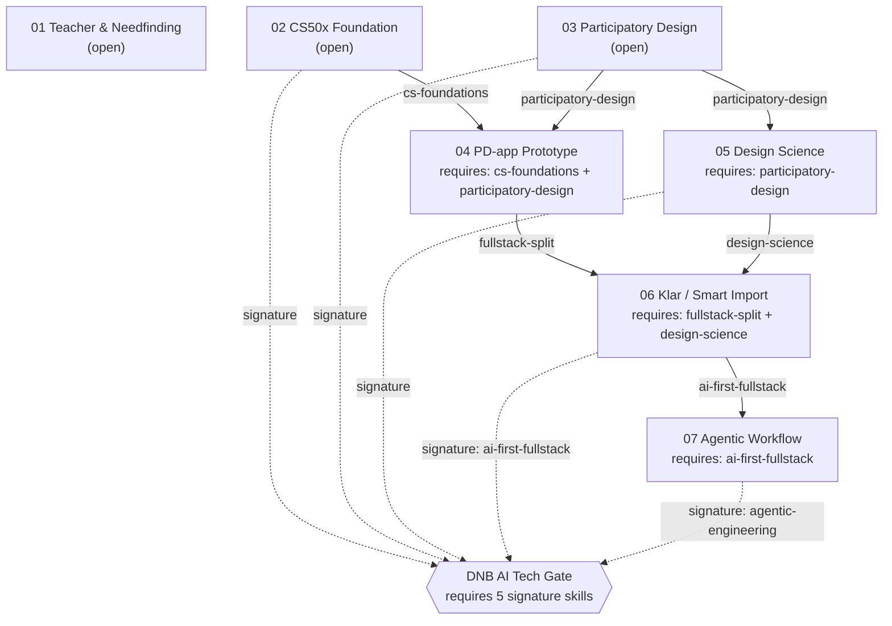

# QUEST_AND_SKILL_TREE.md — "Skamløs Pitch" Content Map

> Source of truth is the data in `app/skamlos-pitch/game/data/`. This is a
> human-readable mirror for review and continuity. If the data changes, update
> this file in the same session.

## Zone dependency graph

Each zone is **locked** until its `requires` skills are unlocked. Completing a
zone grants `grantsSkills` (and reveals `grantsArtifacts`). The **DNB AI Tech
Gate** opens only when all five *signature* skills are held.

Signature skills (gate keys): `cs-foundations`, `participatory-design`,
`design-science`, `ai-first-fullstack`, `agentic-engineering`. Because of the
dependency chain, holding all five necessarily means every zone is complete.

## Zones

| # | id | Title (NO) | Requires | Grants skills | Evidence | Mission |
|---|----|-----------|----------|---------------|----------|---------|
| 01 | `teacher` | Lærer & Needfinding | — | needfinding, classroom-insight, problem-framing, teaching-design | teacher-note | — |
| 02 | `cs50x` | CS50x Foundation-lab | — | cs-foundations, c-basics, python-basics, js-basics, sql-basics, web-fundamentals | cs50-cert | — |
| 03 | `participatory-design` | Participatory Design-verksted | — | participatory-design, co-design, design-thinking, workshop-methods, needs-synthesis | pd-method | — |
| 04 | `pd-app` | PD-app prototype-lab | cs-foundations, participatory-design | fullstack-split, django, vue | pd-frontend, pd-backend | — |
| 05 | `design-science` | Design Science-porten | participatory-design | design-science, build-evaluate-justify, artifact-thinking | design-science-frame | — |
| 06 | `klar` | Klar / Smart Import-lab | fullstack-split, design-science | ai-first-fullstack, react-next, supabase-postgres, auth-roles, smart-import, human-in-the-loop | klar-live, klar-repo, smart-import-artifact | Smart Import |
| 07 | `agentic` | Agentisk arbeidsflyt-verksted | ai-first-fullstack | agentic-engineering, copilot-partner, context-discipline, qa-handoff, claim-boundaries | agentic-dna | Agentic |

## Decision missions

### Smart Import (zone 06 — Klar)
The AI proposes a full timetable from a weekly letter.

| Option | Correct | Outcome |
|--------|---------|---------|
| Publish straight to students | ✗ | Guardrail triggered — student data must not flow out unreviewed |
| **Preview, correct, then approve** | ✓ | Human-in-the-loop — teacher keeps control/responsibility |
| Delete everything | ✗ | Over-correction — the answer is a controlled gate, not avoidance |

### Agentic (zone 07 — Agentic workflow)
An eager agent proposes rewriting master into a distributed platform, straight to prod, no review.

| Option | Correct | Outcome |
|--------|---------|---------|
| YOLO, more agent less review | ✗ | Scope Creep Slime grows; master must not be touched |
| **Context + requirements + review + QA, hold scope** | ✓ | Overclaim Monster defeated; distributed systems = growth direction, not a current claim |
| Ignore the agent, hand-code all | ✗ | Misses the point — use the agent within boundaries |

A correct pick completes the zone and increments **guardrails passed**; a wrong
pick increments **overclaims blocked** and can be retried.

## Evidence (artifacts) & honest boundaries

Every card carries a claim boundary. Public links used:

| id | Kind | Link | Boundary theme |
|----|------|------|----------------|
| teacher-note | concept | — | lived teaching experience, not a credential claim |
| cs50-cert | cert | CS50x certificate (public) | foundational learning, not a CS degree / not expert |
| pd-method | concept | — | examined method; small, non-representative scale |
| pd-frontend | repo | pd-app-frontend (Vue) | early prototype, not a product |
| pd-backend | repo | pd-app-backend (Django) | early prototype, not a product |
| design-science-frame | concept | — | justified design proposal framing |
| klar-live | live | Klar live demo | robust prototype, evaluated with teachers |
| klar-repo | repo | Klar repo | prototype codebase, not enterprise scale |
| smart-import-artifact | concept | — | human-in-the-loop, nothing auto-published |
| agentic-dna | concept | — | documented solo workflow, designed to share in a team |
| companion-flutter | repo | companion repo (Flutter) | exploratory companion app |
| laser-egg | concept | — | playful easter egg |

> The exact URLs live in `app/skamlos-pitch/game/data/artifacts.ts` and
> `easterEggs.ts`, and contact details in `app/skamlos-pitch/game/i18n.ts`
> (`CONTACT`). All are public and verified.

## Easter eggs

| id | kind | Where | Note |
|----|------|-------|------|
| flutterfly | flutterfly | near zone 01 area | links to the Flutter companion repo |
| laser-egg | egg | far back-left of the field | playful lore |
| rubber-duck | duck | back-right of the field | rubber-duck debugging nod |

## Skill groups

- **foundation** — programming foundation (CS50x line).
- **design** — needfinding, participatory design, design science.
- **fullstack** — frontend/backend split, Django, Vue, React/Next, Supabase, auth.
- **ai** — AI-first fullstack, Smart Import, human-in-the-loop, agent-as-partner.
- **craft** — agentic engineering, context discipline, QA/handoff, claim boundaries.

Full skill list with glyphs lives in `app/skamlos-pitch/game/data/skills.ts`.
