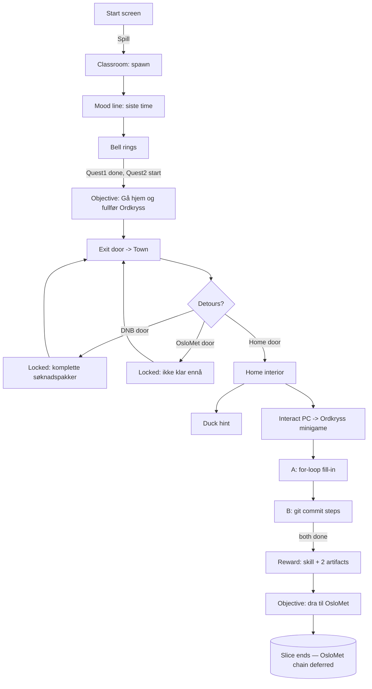

# SKAMLOS 2D RPG — Prologue Slice (Step-by-Step Storyboard)

> Status: Planning only. This is the exact, ordered storyboard for the **first playable
> slice**. An implementer should be able to build the slice from this doc plus
> `SKAMLOS_2D_RPG_IMPLEMENTATION_BRIEF.md` (stack/data model) and
> `SKAMLOS_2D_RPG_WORLD_MAP.md` (maps/lock states).
> Creative source: `SKAMLOS_2D_RPG_GAME_DESIGN_BRIEF.md` §4 (Prolog).

All dialogue here is **Norwegian-first** and **claim-safe**. Keep text short (design brief
§9): 1 mood line, 2–3 short points max, 1 clear action, 1 clear reward.

---

## 0. Scope of this slice

Playable: **Classroom start → bell → walk home through town → home/PC → Ordkryss minigame
(for-loop + git commit) → reward (skill + 2 artifacts) → pointer toward OsloMet.**

Everything after the OsloMet pointer is **deferred** (see implementation brief §7).

---

## 1. Start screen

- Title: **Skamløs Pitch: Kompetansebyen**.
- One-line tagline (claim-safe): `"Et lite eventyr om å bygge kompetanse — stein for stein."`
- Buttons: **Spill** (start), **Tilbake til portefølje** (link back to the DNB page).
- Controls hint: `Beveg deg: WASD / piltaster · Snakk/undersøk: E eller mellomrom · Lukk: Esc`.
- Sets phase `start → playing` on Spill.

---

## 2. Scene: Classroom (`classroom`)

### 2.1 On enter

- Player spawns at a desk (`spawn-default`), facing up/down toward the room.
- Ambient/mood line (auto, once): `"Siste time er snart ferdig. Etterpå venter Ordkryss hjemme."`
- Quest 1 `siste-time` is active with objective: `"Vent ut timen."` (or simply auto-runs).

### 2.2 The bell

- After a short beat (a few seconds, or when the player moves toward the door), **the bell
  rings**: a short bell sound (or, if no audio, a clear visual flash + line).
- Bell line: `"*Det ringer ut.*"`
- This **completes Quest 1** and **starts Quest 2** `hjem-til-ordkryss`:
  - Objective (HUD): `"Gå hjem og fullfør CS50x-sluttprosjektet: Ordkryss."`
  - `nextHint` (signpost-ready): `"Hjem er nedover veien."`

### 2.3 Leaving

- Player walks to the classroom **door** (visible). The door exit triggers a load into the
  town map at spawn `from-school`.
- Collision QA: pulter/kateter/vegger are visible and collidable; no invisible walls.

> Claim note: the classroom is the honest starting point — Stian's journey starts from a
> classroom, not a CS degree. Keep any student NPC lines as ambience only in this slice.

---

## 3. Scene: Town worldmap (`town`)

### 3.1 Navigation

- Player appears at `from-school`. Camera follows. Grusveier lead toward **Stians hjem**.
- The **DNB building** is visible up the map (locked). **OsloMet** is visible (locked).
- A **skiltpost** at Bykryss points the way (direction only):
  `"Hjem er nedover veien. Ordkryss venter."`

### 3.2 Optional detours (readable feedback, no dead ends)

- If the player tries the **DNB door**: `"Resepsjonen tar bare imot komplette søknadspakker."`
- If the player tries **OsloMet**: `"Universitetet venter. Du er ikke helt klar for dette ennå."`
- If the player tries **Nikkos hus** / **workshop entrance**: their locked lines (world-map doc §2).
- None of these block progress; they just give flavor + a clear "not yet."

### 3.3 Arriving home

- The **home door** triggers a load into `home` at spawn `from-home`.

---

## 4. Scene: Stians hjem (`home`)

### 4.1 On enter

- Warm, personal room. Visible: **pult, PC med to skjermer, badeand**, kaffekopp, bøker.
- Objective persists: `"Sett deg ved PC-en og fullfør Ordkryss."`

### 4.2 The rubber duck (hint)

- Interacting with `home-duck` gives one short, dry line (not an AI joke):
  - `Anda: "Ta én løkke av gangen."`
- The duck may give a second line only if the player retries the for-loop (see §5.1):
  - `Anda: "Tell fra 1 til 5. Ikke noe mer."`

### 4.3 The PC

- Interacting with `home-pc` (prompt `"Undersøk PC-en"`) opens the **Ordkryss minigame**
  (`startMinigame: "ordkryss"`), a React DOM modal hosted by the engine.

---

## 5. Minigame: Ordkryss (two challenges)

> The minigame is a small modal, not a full IDE. Keep it friendly and fast. **Spelling guard:
> it is "Ordkryss", never "Ordryss".** Add a unit/lint check on the literal string.

Intro line in the modal:
`"Ordkryss — CS50x-sluttprosjektet ditt. To små ting gjenstår."`

### 5.1 Challenge A — JavaScript for-loop

- **Goal:** a simple, real for-loop. Recommended task (claim-safe, beginner-true):
  - Prompt: `"Skriv en løkke som skriver tallene 1 til 5 (én per linje)."`
  - Starter shown:

        for (let i = ___; i ___ 5; i___) {
          console.log(i);
        }

  - Interaction is **fill-in-the-blanks / pick-the-right-tokens**, NOT a live `eval` of free
    text (security + simplicity — see framework doc §7). Correct fill: `1`, `<=`, `++`.
  - On correct: `"5 linjer, 1 til 5. Løkka går rundt akkurat nok ganger."` → proceed.
  - On wrong: gentle retry + the duck hint; never a hard fail.

- **Why this task:** it mirrors the honest "small, precise instructions repeated exactly"
  foundation framing, and it's genuinely CS50x-level.

### 5.2 Challenge B — git commit

- **Goal:** turn the finished work into a commit. Steps: stage → message → commit.
  - Setup: `"Ordkryss funker. På tide å lagre arbeidet i git."`
  - Show "endrede filer": `index.html`, `ordkryss.js`, `styles.css`.
  - Step 1 (stage): pick "Legg til alle endringer" (`git add .` represented as a button/choice).
  - Step 2 (message): choose/compose a sensible message. Offer options where the good one is
    clear, e.g.:
    - ✅ `"Fullfør Ordkryss: generering og utfylling av kryssord"`
    - ❌ `"stuff"` / ❌ `"asdf"` (gentle nudge: `"En commit-melding bør si hva som faktisk ble gjort."`)
  - Step 3 (commit): confirm → `"Committed. Arbeidet er lagret."`
- Keep it conceptual and correct; no real git execution.

### 5.3 Minigame completion

- Completing both challenges completes Quest 2 and triggers the reward (§6) and closes the
  modal back to the home scene.

---

## 6. Reward

On Quest 2 completion, grant and surface (toast + quest/skill/artifact logs):

### 6.1 Skill

- **Grunnleggende programmering** (`grunnleggende-programmering`, group `foundation`).
- Skill-log detail lines (viewable in the Skill Log):
  - `C`, `Python`, `SQL`, `Flask`, `Django`, `JavaScript`, `HTML/CSS`, `web fundamentals`,
    `git basics`.
- **CLAIM NOTE (must honor):** CS50x covered C, Python, SQL, **Flask**, JS, HTML/CSS.
  **Django** is from the later predecessor prototype, not CS50x. Frame the skill log as
  "grunnmuren spenner over disse teknologiene på tvers av CS50x og tidlige prosjekter" —
  never "CS50x lærte meg Django." Foundation framing only: not a CS degree, not expert level.
- Toast: `"Ny ferdighet: Grunnleggende programmering"`.

### 6.2 Artifacts

- **CS50x-sertifikat** (`cs50x-cert`, kind `cert`):
  - description: `"Harvards CS50x — en ærlig grunnmur i programmering."`
  - boundary: `"Foundational læring, ikke en CS-grad eller ekspertnivå."`
  - `href`: the public CS50x certificate URL **if already used on the DNB site**; otherwise
    leave a TODO for the user to supply — **do not invent** a certificate URL.
- **Ordkryss – demo** (`ordkryss-video`, kind `video`):
  - `href`: `https://youtu.be/tI5fU1aAAvI`
  - linkLabel: `"Se demoen"`.
- Toast: `"Nytt bevis samlet: CS50x-sertifikat + Ordkryss-demo"`.

---

## 7. Handoff into the next chain (pointer only)

- After the reward, the objective/signpost updates to point at OsloMet — **without** opening
  the chain:
  - Objective: `"Neste: dra til OsloMet."`
  - Skiltpost line (if revisited): `"OsloMet ligger oppover veien. Det kan være verdt en tur."`
- The OsloMet door remains **locked** with a readable line. The Workshop / Participatory
  Design chain (Quest 3+) is **not** implemented in this slice.
- This is the clean seam where the next code pass picks up (see implementation brief §7–§8).

---

## 8. Slice flow diagram

---

## 9. Per-beat acceptance (maps to the brief's criteria)

| Beat       | Done when                                                                                    |
| ---------- | -------------------------------------------------------------------------------------------- |
| Start      | `/skamlos-rpg` start screen with Spill + back link; noindex                                  |
| Classroom  | controllable spawn, visible collidable props, mood line                                      |
| Bell       | bell fires; Quest 1→2 transition; objective set                                              |
| Town       | readable town; DNB + OsloMet visible & locked with text; signpost points home                |
| Home       | desk + PC(2 monitors) + duck present; duck gives a dry hint                                  |
| Minigame A | for-loop fill-in accepts correct, retries gently on wrong                                    |
| Minigame B | git commit stage→message→commit; weak message nudged                                         |
| Reward     | skill "Grunnleggende programmering" + skill log; CS50x cert + Ordkryss video (`tI5fU1aAAvI`) |
| Handoff    | objective/signpost points to OsloMet; OsloMet stays locked; chain not built                  |
| Hygiene    | build+lint pass; master/VG X/portfolio untouched; FILE_TREE updated                          |

---

## 10. Text bank (claim-safe, Norwegian-first)

Copy these strings into pack data (`dialogue.ts`, `quests.ts`). English optional for v1.

- Mood: `"Siste time er snart ferdig. Etterpå venter Ordkryss hjemme."`
- Bell: `"*Det ringer ut.*"`
- Quest 2 objective: `"Gå hjem og fullfør CS50x-sluttprosjektet: Ordkryss."`
- Signpost (home): `"Hjem er nedover veien. Ordkryss venter."`
- DNB locked: `"Resepsjonen tar bare imot komplette søknadspakker."`
- OsloMet locked: `"Universitetet venter. Du er ikke helt klar for dette ennå."`
- Duck 1: `"Ta én løkke av gangen."`
- Duck 2 (retry): `"Tell fra 1 til 5. Ikke noe mer."`
- Minigame intro: `"Ordkryss — CS50x-sluttprosjektet ditt. To små ting gjenstår."`
- For-loop ok: `"5 linjer, 1 til 5. Løkka går rundt akkurat nok ganger."`
- Commit nudge: `"En commit-melding bør si hva som faktisk ble gjort."`
- Commit done: `"Committed. Arbeidet er lagret."`
- Reward toast: `"Ny ferdighet: Grunnleggende programmering"`
- Handoff: `"Neste: dra til OsloMet."`
- Signpost (OsloMet): `"OsloMet ligger oppover veien. Det kan være verdt en tur."`

> Do not add the metaphor, "ærlig grense", or "claim-safe" as visible in-game text. The
> honesty is in _what is shown_, not in lecturing the player.
